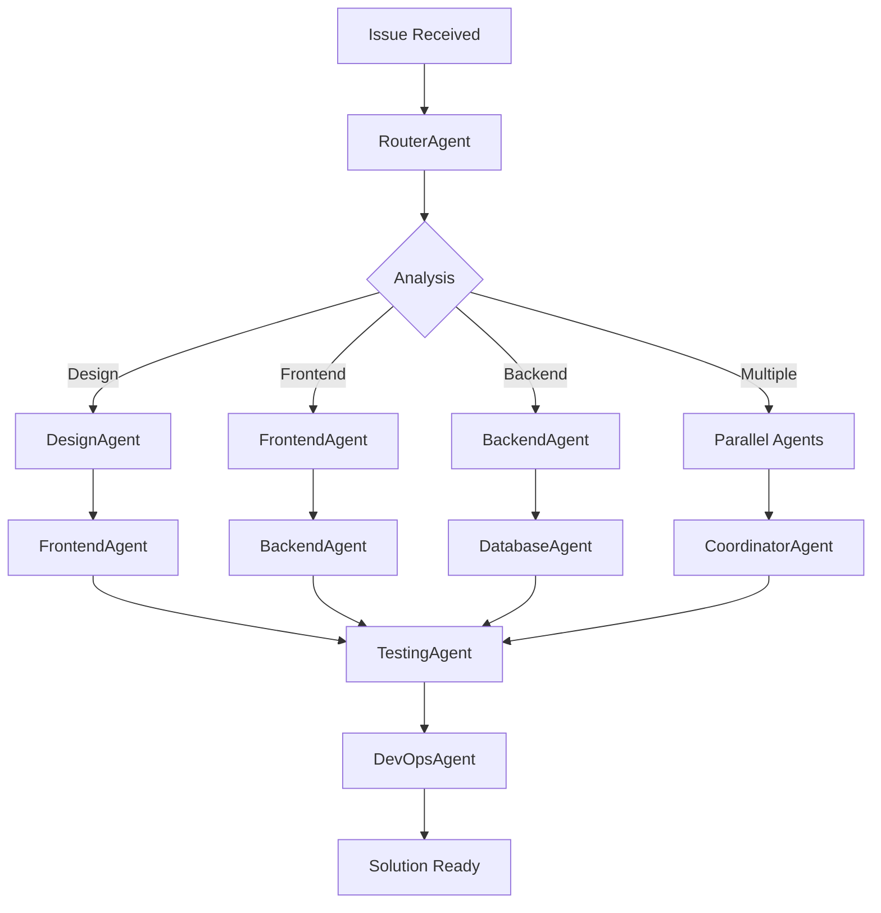
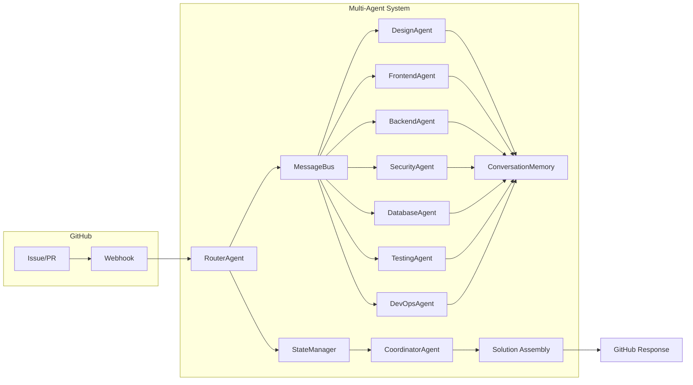

# Flow Description: Multi-Agent System Workflow

## 🌊 High-Level System Flow

This document describes the high-level workflow and interaction patterns within the multi-agent system architecture.

### 1. **Issue Ingestion**
- GitHub webhook receives issue/PR
- RouterAgent analyzes the request
- Determines appropriate agent(s) based on:
  - Issue labels
  - Content keywords
  - File paths affected
  - Historical patterns

### 2. **Initial Assignment**
- RouterAgent assigns to primary agent(s)
- Creates workflow context in StateManager
- Notifies CoordinatorAgent of new workflow
- Sets initial workflow state

### 3. **Agent Processing**

### 4. **Inter-Agent Communication**
- Agents communicate via MessageBus
- Three main patterns:
  - **Direct Request**: Agent A asks Agent B for specific input
  - **Broadcast**: Agent announces completion to all relevant agents
  - **Coordinator-Mediated**: Agents communicate through CoordinatorAgent

### 5. **State Management**
- ConversationMemory maintains context
- StateManager tracks:
  - Current workflow state
  - Agent assignments
  - Task completion status
  - Dependencies between tasks
  - Error states and recovery attempts

### 6. **Solution Assembly**
- CoordinatorAgent collects outputs
- Validates completeness
- Resolves conflicts
- Ensures consistency
- Prepares final response

### 7. **Output Delivery**
- Final solution sent to GitHub
- Workflow context archived
- Metrics logged for analysis
- Agents return to idle state

## 🔄 Typical Workflow Example

### Scenario: Full-Stack Feature Request

1. **User creates issue**: "Add user profile page with authentication"
2. **RouterAgent analyzes**: Identifies frontend + backend + security needs
3. **Assigns to**: DesignAgent, FrontendAgent, BackendAgent, SecurityAgent
4. **Parallel processing begins**:
   - DesignAgent creates wireframes and UI specs
   - FrontendAgent plans component structure
   - BackendAgent designs API endpoints
   - SecurityAgent defines auth requirements
5. **First coordination point**:
   - DesignAgent shares wireframes with FrontendAgent
   - SecurityAgent provides auth specs to BackendAgent
6. **Second phase**:
   - FrontendAgent implements UI based on designs
   - BackendAgent implements APIs with security requirements
   - DatabaseAgent designs data models
7. **Integration phase**:
   - FrontendAgent and BackendAgent coordinate on API contracts
   - TestingAgent creates test plans for all components
8. **Final assembly**:
   - CoordinatorAgent validates all pieces
   - DevOpsAgent prepares deployment strategy
9. **Solution delivered**: Complete implementation with tests and deployment plan

## 📦 Data Flow Diagram

## ⚙️ Key Components Interaction

### MessageBus
- Pub/Sub system for agent communication
- Topics for different message types:
  - `task.request`: Request for work
  - `task.complete`: Work completion notification
  - `info.request`: Request for information
  - `info.response`: Information response
  - `error`: Error reporting

### StateManager
- Tracks workflow state machine
- States: `pending`, `processing`, `blocked`, `completed`, `failed`
- Manages task dependencies
- Handles retries and error recovery

### CoordinatorAgent
- Orchestrates complex workflows
- Resolves conflicts between agents
- Manages priority and resource allocation
- Ensures SLA compliance

## 🎯 Benefits of This Flow

1. **Efficient Resource Utilization**: Agents work in parallel when possible
2. **Specialized Processing**: Each task handled by domain expert
3. **Clear Communication**: Structured message patterns
4. **State Awareness**: Full context maintained throughout workflow
5. **Error Resilience**: Built-in recovery mechanisms
6. **Scalability**: Easy to add more agents or workflow types

## 📊 Performance Characteristics

- **Throughput**: Multiple issues processed concurrently
- **Latency**: Reduced by parallel processing
- **Reliability**: State management ensures no lost context
- **Maintainability**: Clear separation of concerns
- **Extensibility**: New agents can be added without disrupting existing flows

This flow architecture enables the multi-agent system to handle complex development tasks efficiently while maintaining high quality and consistency across all outputs.